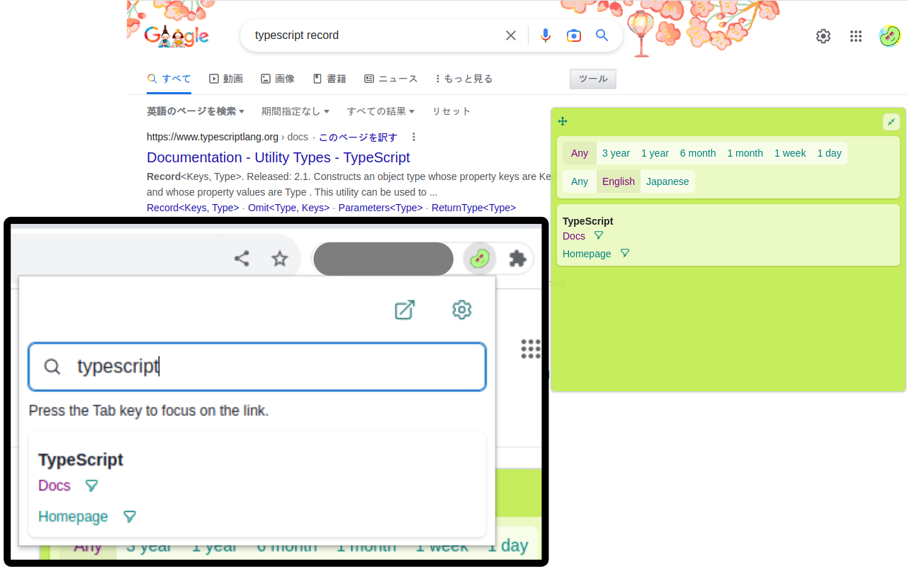
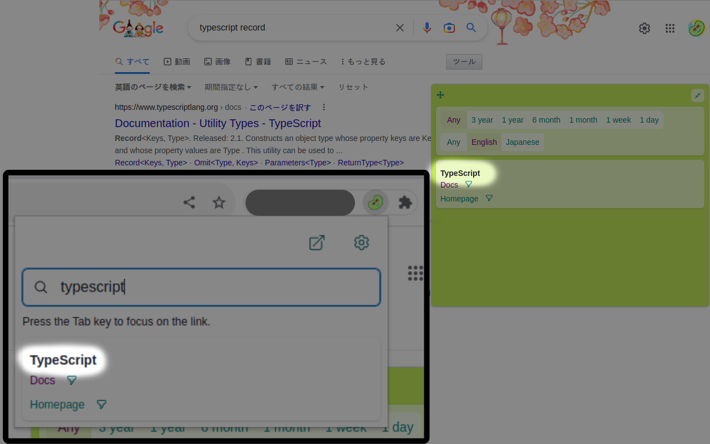
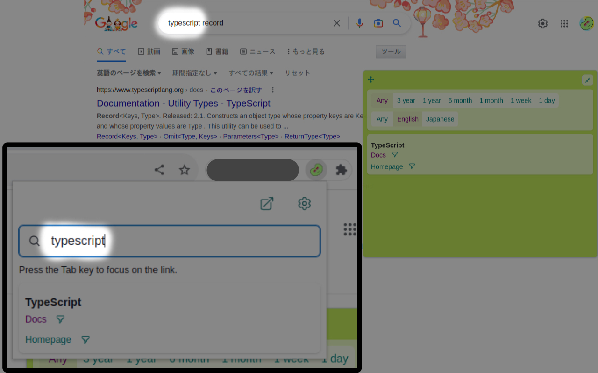
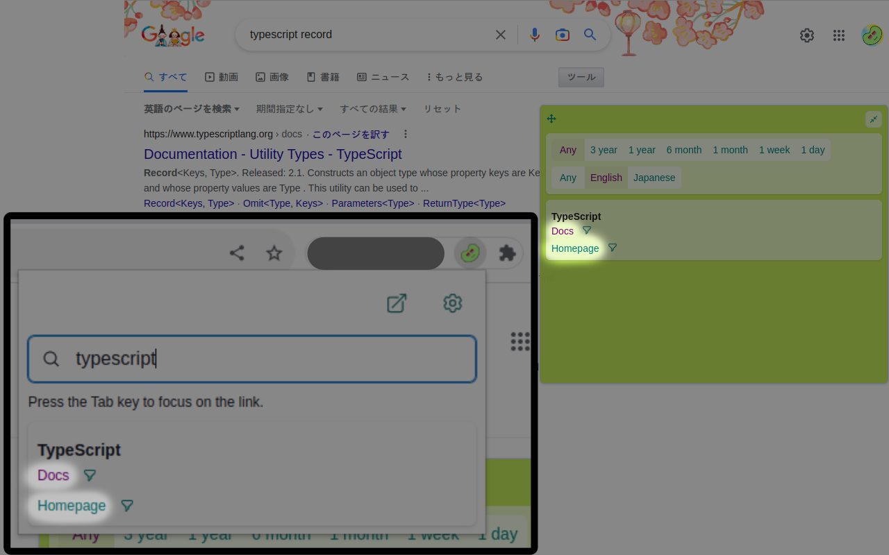

# choomame-custom-link-collection

## What is Custom Link items?

This feature allows easy access to frequently viewed pages, site searches, official documents, and other links from extensions and Google search.

The components of Custom Link items are as follows.

### group

The name of the category that the link's destination belongs to. For example, "JavaScript" or "TypeScript".

`group` must be between 1 and 50 characters.

### match

A word or regular expression that is expected to be used in Google searches for the destination of the link. For example, for React, the match could be "react".

`match` must be between 1 and 100 characters.

### name

A name that represents the destination of the link, such as "Reference" or "Homepage".

`name` must be between 1 and 50 characters.

### url

The URL of the link. If the site has a search feature, you can insert queries into the URL parameters, replace the query part of the URL with %s. For example, "https://developer.mozilla.org/en-US/search?q=%s".

`url` must not exceed 200 characters.

## For Collection developers

### What is Collection?

`Collection` is a JSON5 format file that collects Custom Link items. When a user registers the URL that returns JSON5 in the settings, Custom Link items written in that file can be registered at once.

The registered JSON5 is automatically fetched and updated about once a day.

The components of Custom Link Collection are as follows.

#### id

A unique identifier. It must be between 1 and 50 characters.

#### name

A name that represents the collection. It must be between 1 and 50 characters.

### items

Array containing Custom Link items.
